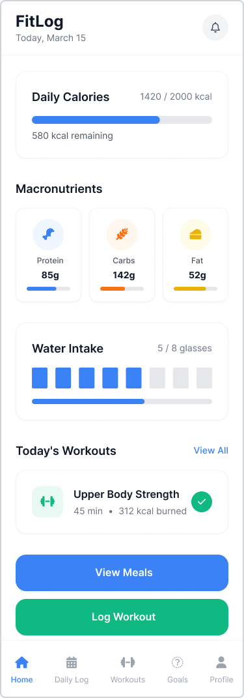
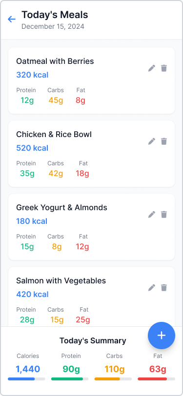
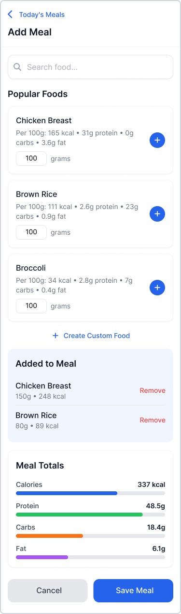
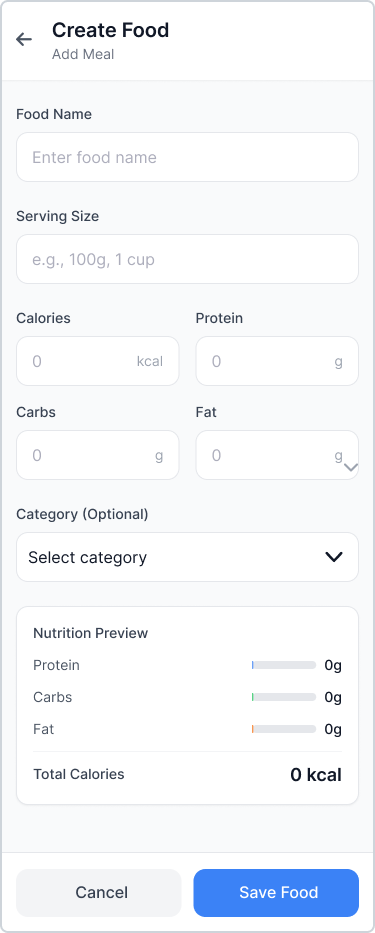

# FitLog — App

## Short description
We need a mobile app that helps users stay on track with their nutrition and workouts. The app allows logging **daily meals** and automatically calculates **calories and macronutrients** (protein, carbs, fat). Users can also log **gym or cardio workouts**, and the app estimates **energy burned** to adjust daily maintenance calories. It should work **offline**, letting people add meals or workouts without internet, then **sync** all data later. The main goal is to give users a simple overview of their daily progress and help them reach their fitness goals.

---

## Domain details

### FoodItem
- `id` – unique identifier  
- `name` – name of the food  
- `servingSize` – quantity in grams/ml  
- `kcalPerServing` – calories per serving  
- `proteinPerServing` – grams of protein per serving  
- `carbsPerServing` – grams of carbs per serving  
- `fatPerServing` – grams of fat per serving  
- `brand` – optional brand name  

**Description:** Represents an ingredient or food used to build meals.

### Meal
- `id` – unique identifier  
- `userId` – owner of the meal  
- `name` – meal name (e.g. “Omelette with toast”)  
- `items` – list of FoodItems and servings  
- `kcalTotal`, `proteinTotal`, `carbsTotal`, `fatTotal` – totals (auto-calculated)  
- `createdAt` – date created  

**Description:** A reusable meal built from food items.

### DailyLog
- `id` – unique identifier  
- `userId` – linked user  
- `date` – day of the log  
- `entries` – meals or items eaten that day  
- `waterIntakeMl` – total water intake  
- `kcalTotal`, `proteinTotal`, `carbsTotal`, `fatTotal` – daily totals  
- `notes` – optional text  

**Description:** Records what the user consumed and shows progress for the day.

### Workout
- `id` – unique identifier  
- `userId` – linked user  
- `type` – Strength or Cardio  
- `exercises` – sets/reps/weight (for strength) or duration/distance (for cardio)  
- `kcalBurned` – estimated calories burned  
- `startTime`, `endTime` – timestamps  

**Description:** Logs the user’s training session and burned calories.

### Goal
- `id` – unique identifier  
- `userId` – linked user  
- `type` – DailyKcal, DailyProtein, Weight, or WeeklyWorkouts  
- `targetValue` – goal value  
- `currentBaseline` – starting point  
- `deadline` – optional date  
- `status` – Active, Achieved, or Archived  

**Description:** Represents a progress goal that can be tracked over time.

---

## CRUD details

### FoodItem
- **Create:** Add a custom food item with serving size and macros.  
- **Read:** Browse or search foods from the catalog.  
- **Update:** Edit details (macros, name, serving size).  
- **Delete:** Remove a custom item.

### Meal
- **Create:** Build a meal by combining FoodItems.  
- **Read:** View saved meals and their macros.  
- **Update:** Edit servings or ingredients.  
- **Delete:** Remove a saved meal.

### DailyLog
- **Create:** Add meals or items for today.  
- **Read:** Display total calories and macros.  
- **Update:** Adjust portions or add notes.  
- **Delete:** Remove a meal or a full day entry.

### Workout
- **Create:** Log a strength or cardio workout.  
- **Read:** View training history.  
- **Update:** Edit sets/reps or duration.  
- **Delete:** Remove a workout.

### Goal
- **Create:** Add a new fitness goal.  
- **Read:** View progress charts.  
- **Update:** Modify target or deadline.  
- **Delete:** Archive an old goal.

---

## Persistence details

**Local database:**  
Stores all user data (meals, daily logs, workouts, goals, and profile) for offline use.

**Server:**  
Stores backups and synchronizes with the local database when online.

**At least three operations persisted on both:**  
1. Create DailyLog entries  
2. Update Workout details  
3. Update UserProfile and macro targets  

**Sync behavior:**  
- When offline, all operations are stored locally and queued.  
- When online, changes sync automatically with the server.  
- Conflicts are resolved by keeping the latest edit.

---

## Offline scenarios

- **Create:** Add a meal or workout offline → saved locally and marked “Pending Sync.”  
- **Read:** Open cached data (latest logs and totals) even without internet.  
- **Update:** Edit meals/workouts → local changes shown instantly and synced later.  
- **Delete:** Removing an entry offline hides it immediately and syncs the delete when back online.

---

The following Figma screens illustrate the main user flows of the **FitLog** mobile app.  
Each screen supports the CRUD operations described above and aligns with the client requirements.

1. **Daily Dashboard**  
   Displays today’s calorie and macronutrient progress (Protein, Carbs, Fat), water intake, and logged workouts.  
   - Buttons: **View Meals** and **Log Workout**  
   - Navigation bar: Home, Daily Log, Workouts, Goals, Profile  

2. **Today’s Meals**  
   Lists all meals logged for the current day, showing calories and macros for each.  
   - Floating **+** button to add a new meal  
   - Each meal card includes edit (✏️) and delete (🗑) options  
   - Bottom summary shows total daily calories and macronutrients  

3. **Add Meal**  
   Allows the user to build a meal from existing foods.  
   - **Search bar** to find foods  
   - “Popular Foods” list with macros per 100g  
   - Quantity input and **+** button to add foods  
   - Section **Added to Meal** to manage selected foods  
   - **Create Custom Food** button to add new foods manually  
   - Displays **Meal Totals** (Calories, Protein, Carbs, Fat)  

4. **Create Food**  
   Enables users to define new custom foods.  
   - Fields: Food name, serving size, calories, protein, carbs, fat, and optional category  
   - Preview section for macro visualization  
   - Buttons: **Cancel** and **Save Food**  

### Mockup Screens

| Home (Dashboard) | Today's Meals |
|------------------|---------------|
|  |  |

| Add Meal | Create Food |
|-----------|-------------|
|  |  |

---

# crudProject
See the details for CrudProject from here: http://www.cs.ubbcluj.ro/~dan/ma/labPlan.html

In this repository, you should maintain your work for the CrudProject project for both projects (Native and Non-Native).
Eg. You should have a directory structure like this:
- idea - maintaining a Readme.md file with the project idea. 
- native - for the native project.
- non-native - for non-native project.
